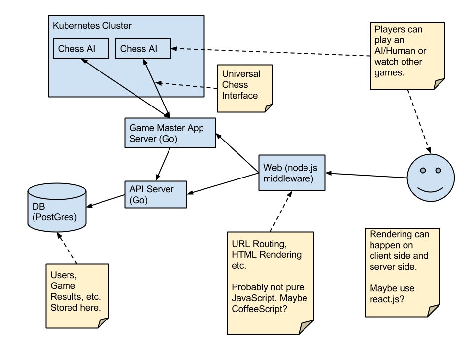

chess-ai-competition
====================

Chess API Competition is a service for chess AI and/or humans to play and rank
against each other.

# Architecture

The architecture is service oriented and broken up into multiple servers
communicating using JSON.

## The Data Service

The [data service](dataapi/) will be used to interact with the main database
which will store information about players, AI, games etc.

## The Game Master

The game master will be responsible for managing games that are currently being
played and relay messages about moves between players (AI or human) and also to
the humans watching the game.

## Game AI

Game AI will be run in docker containers in a kubernetes cluster. AI will
communicate with the Game Master using
[Universal Chess Interface](http://en.wikipedia.org/wiki/Universal_Chess_Interface).

## Frontend

The frontend server will be a node.js app which gathers data from the other
services and shows the data to the user. We will use JavaScript here to make
use of the asynchronous architecture and so we can render HTML on the server or
on the client browser.

# Status

This is very much a work in progress and in a mostly theoretical phase. Pretty
much everything is subject to change in the future.
